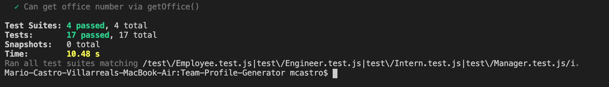
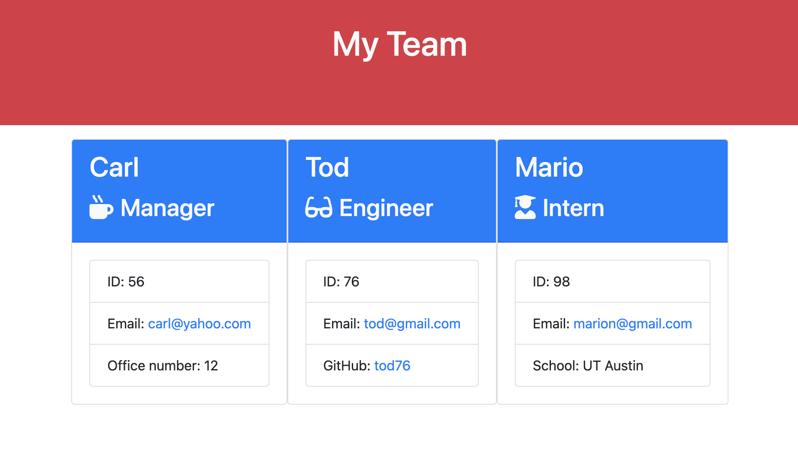

# Team Profile Generator

This is a Node CLI that takes in information about employees and generates a
HTML webpage listing the profiles of all members added to the team.

## Functionality

-The application asks the user information and generates three roles: Manager,
Engineer, and Intern.

-After inserting the info, the application send the profiles to the HTML and
lists the information in three predesigned cards.

-The user can then erase the current cards and create a new team.

## Libraries and Dependencies Used in the Current Version of This Application

-The application uses the
[Inquirer npm package](https://github.com/SBoudrias/Inquirer.js/), Node CLI, and
the [jest](https://jestjs.io/) for running the LI tests. All tests passed.

To use the application remember to run a `npm install` to add Jest and Inquirer.

### Future Development and Fixes

-Need to add functionalities so new cards can be appended after running the
application.

-Clean the HTML before adding the cards.

### Tests

-All tests passed using the Jest npm library.

## Video and Pictures Showcasing Current Funcionalities

-Screenshot showing application's functionalities.
-Video sampling the application and CLI tests.

## [Link to .MOV video showcasing functionalities](https://drive.google.com/file/d/1C3Bu4uxOM6qXzl9b01in2RIwAxjsZrXL/view?usp=sharing)
